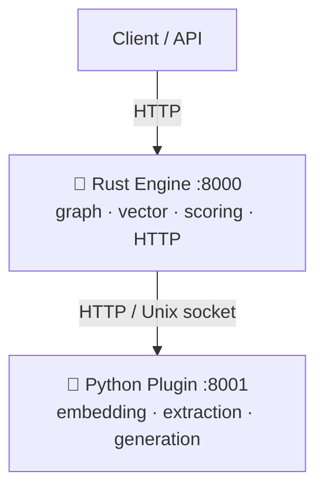
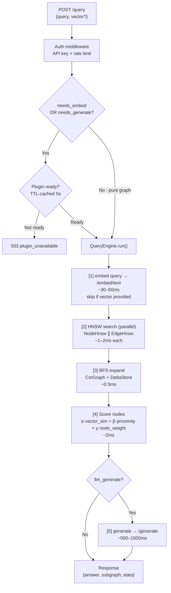
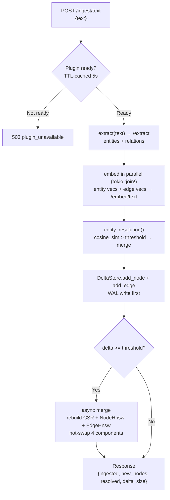
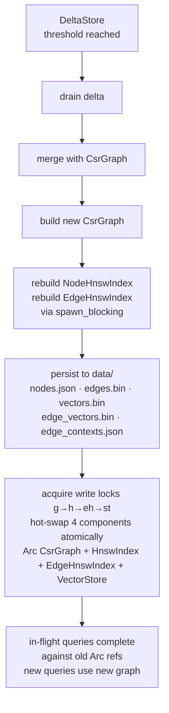
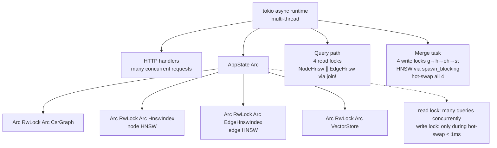

# Architecture — LinkingMem

## 1. Overview

The system is split into 2 separate processes, each doing what it does best:



**Why separate?** Rust lacks a mature AI ecosystem. Python lacks the performance required for graph/vector compute. Each side focuses on its strengths.

---

## 2. Directory Structure

```
ai-graph-engine/
│
├── core/                        ← Rust engine
│   └── src/
│       ├── main.rs              HTTP server (axum :8000) + bootstrap
│       ├── app_state.rs         AppState — shared state, hot-swap merge
│       ├── config.rs            Reads plugins.toml + env vars
│       ├── query.rs             QueryEngine — full pipeline + cache
│       ├── entity_resolution.rs Embedding-based entity dedup on ingest
│       ├── delta.rs             DeltaStore (LSM-style) + WAL
│       ├── cache.rs             EmbedCache (moka concurrent LRU)
│       ├── plugin.rs            HTTP client Rust → Python (TTL health cache)
│       ├── metrics.rs           Prometheus-compatible counters
│       │
│       ├── graph/
│       │   ├── csr.rs           CsrGraph — bidirectional CSR + BFS
│       │   └── builder.rs       Load/save binary + JSON ingest
│       │
│       ├── storage/
│       │   ├── mod.rs           StorageBackend trait (write/read/exists/local_path)
│       │   └── local.rs         LocalStorage — wraps std::fs, Phase 1 implementation
│       │
│       ├── vector/
│       │   ├── store.rs         VectorStore — mmap, zero-copy read
│       │   └── hnsw.rs          HnswIndex + EdgeHnswIndex (instant-distance)
│       │
│       ├── api/
│       │   ├── handlers/
│       │   │   ├── query.rs     POST /query
│       │   │   ├── ingest.rs    POST /ingest/text  POST /ingest/json
│       │   │   ├── admin.rs     GET /health /metrics /graph/stats /nodes
│       │   │   └── export.rs    GET /export (graph export endpoints)
│       │   ├── dto/
│       │   │   ├── query.rs     QueryReq + PipelineControl + QueryResponse
│       │   │   ├── ingest.rs    IngestTextReq + IngestJsonReq + IngestResponse
│       │   │   └── export.rs    ExportRequest + ExportResponse
│       │   └── error.rs         ApiError — unified error type (400/422/503/502/500)
│       │
│       ├── middleware/
│       │   └── auth.rs          API key auth + token-bucket rate limiter
│       │
│       └── bin/
│           ├── server.rs        Entry point: HTTP server
│           └── ingest.rs        CLI one-time data prep
│
├── plugins/                     ← Python plugin server
│   └── text/
│       ├── main.py              FastAPI: /health /info /embed/text /extract /generate
│       ├── embed.py             Embedding logic (SentenceTransformers)
│       ├── extract.py           Entity extraction (LLM)
│       ├── generate.py          Answer generation (LLM)
│       ├── reason.py            Reasoning utilities
│       ├── llm.py               LLM client abstraction
│       ├── schemas.py           Pydantic request/response schemas
│       └── auth.py              Plugin-side auth helpers
│
├── data/                        ← Binary artifacts (git-ignored)
│   ├── nodes.json               Node metadata (id, name, type, weight, props, full_context, embed_context)
│   ├── edges.bin                CSR edge data
│   ├── edge_types.json          Edge type mapping
│   ├── edge_contexts.json       full_context string per edge (parallel to edges.bin)
│   ├── edge_embed_contexts.json embed_context per edge (parallel to edges.bin)
│   ├── vectors.bin              Node embedding vectors (mmap)
│   ├── edge_vectors.bin         Edge embedding vectors (mmap)
│   ├── edge_endpoints.json      (from_id, to_id) pairs parallel to edge_vectors.bin
│   └── delta.wal                Crash-recovery WAL
│
├── plugins.toml                 Plugin endpoint config + query pipeline defaults
├── .env.example                 All env vars with default values
└── docker-compose.yml           Full stack: engine + plugin
```

---

## 3. Data Flow

### 3.1 Query Pipeline



### 3.2 Ingest Pipeline (text)



### 3.3 Delta Merge (background)



---

## 4. Core Components

### CsrGraph

Stores graph topology as **Compressed Sparse Row** — 2 contiguous arrays in memory:

```
offsets: [0, 2, 3, 5, 5]
edges:   [1, 3, 2, 0, 4]

neighbors(node 0) = edges[0..2] = [1, 3]
neighbors(node 1) = edges[2..3] = [2]
```

No pointers, no allocation. BFS achieves a high cache hit rate because edges are contiguous in memory.

Bidirectional: stores both forward and backward edges so BFS can traverse in both directions.

Each `NodeInfo` and `EdgeInfo` has:
- `full_context: String` — verbose description, passed to the LLM when generating an answer
- `embed_context: Option<String>` — short dense description, used for embedding into HNSW. Falls back to `full_context`, then `name`/`edge_type` if absent.

### HnswIndex (Node HNSW)

**Hierarchical Navigable Small World** — approximate nearest neighbor search for node embeddings.

- Layer 0: all nodes, fine-grained search
- Upper layers: subset of nodes, coarse navigation
- Search: greedy descent from top layer → beam search at layer 0 → top-K results
- Complexity: O(log n) vs O(n) brute-force
- Recall: ~95% with ef_construction=200

### EdgeHnswIndex (Edge HNSW)

A dedicated HNSW index for **edge embeddings**. Each edge has its `full_context` embedded — e.g. _"Works at"_ rather than just storing `"work_at"`.

- Search returns `(from_node_id, to_node_id, distance)` — the endpoint nodes of matching edges
- These endpoints are added to the BFS seed set, enabling discovery of the correct graph region via relationship semantics
- Empty index (no edges yet) → no-op search, no error

### VectorStore

Binary file memory-mapped into virtual memory:
```
[dim: u32][num_vecs: u32][vec_0: f32×dim][vec_1: f32×dim]...
```

`get(id)` = pointer arithmetic into the mmap region, zero-copy, no syscall.

Used for both `vectors.bin` (node embeddings) and `edge_vectors.bin` (edge embeddings).

### DeltaStore + WAL

**Write path**: new data → in-memory adjacency list + WAL on disk (crash recovery).

**Read path**: queries search both the main CsrGraph and the DeltaStore in parallel.

**Compaction**: when `delta.size() >= DELTA_MERGE_THRESHOLD`, an async rebuild is triggered. Pattern mirrors LSM-tree.

WAL entries for edges include `vec: [f32]` (edge embedding) to enable full replay after a crash.

### QueryCache

Caches complete query results by query string (moka concurrent LRU).
- `QUERY_CACHE_SIZE`: max entries (default 10000)
- `QUERY_CACHE_TTL_SECS`: TTL (default 300s)
- Cache hit: < 5ms (bypasses the entire pipeline)

### EmbedCache

Caches embedding vectors of hot nodes in RAM. Avoids re-reading from mmap on every scoring pass.
- `EMBED_CACHE_SIZE`: max entries (default 50000 ≈ 75MB with dim=384)

### Auth + Rate Limiter

- Single `MASTER_KEY` env var — token == MASTER_KEY → pass, else → 401
- Constant-time comparison (timing-safe XOR, no timing leak)
- Token bucket rate limiting per IP (public routes) and per key (protected routes)
- Unset `MASTER_KEY` = dev mode (no auth required)

---

## 5. Plugin System

A plugin is any HTTP server that implements 3 endpoints: `/embed/text`, `/extract`, `/generate`.

The Rust engine calls the plugin via `plugin.rs` — an HTTP client with a **TTL-cached health check**:
- Before every request **that uses the plugin**, the engine calls `check_ready()`
- The health result is cached for 5 seconds — avoids per-request overhead
- `/query`: checks only when `needs_embed` (no `vector` provided) **or** `needs_generate` (`llm_generate=true`). If both are false (pre-computed vector + LLM skipped), the check is bypassed entirely — a pure graph query never returns 503
- `/ingest/text`, `/ingest/json`: always checks because embed is always called
- If the plugin is not ready → immediately return **HTTP 503**, without attempting to call the plugin

All 3 operations can point to the same server or to 3 different servers, configured in `plugins.toml`.

See details: [`docs/PLUGIN_INTERFACE.md`](PLUGIN_INTERFACE.md)

---

## 6. Concurrency Model



In-flight queries hold an `Arc` reference to the old graph — they are never interrupted during a merge hot-swap. The old reference is dropped automatically when the query completes.

---

## 7. Persistence

| File | Format | Description |
|---|---|---|
| `nodes.json` | JSON array | Node metadata (id, name, type, props, weight, full_context, embed_context) |
| `edges.bin` | Binary CSR | offsets + edges + weights + edge_type indices |
| `edge_types.json` | JSON array | String labels for edge types |
| `edge_contexts.json` | JSON array | full_context string per edge, parallel to edges.bin |
| `edge_embed_contexts.json` | JSON array | embed_context per edge, parallel to edges.bin |
| `vectors.bin` | Binary | Header (dim, count) + f32 node embedding vectors |
| `edge_vectors.bin` | Binary | Header (dim, count) + f32 edge embedding vectors |
| `edge_endpoints.json` | JSON array | `[(from_id, to_id)]` parallel to edge_vectors.bin |
| `delta.wal` | Binary WAL | Write-ahead log for crash recovery (nodes + edges + vecs) |

On startup: load `nodes.json` + `edges.bin` → build CsrGraph; mmap `vectors.bin` → build HnswIndex; load `edge_vectors.bin` + `edge_endpoints.json` → build EdgeHnswIndex; replay `delta.wal` if there are unmerged entries.

---

## 8. Limitations and Trade-offs

| Issue | Current state | Resolution path |
|---|---|---|
| Rebuild HNSW on every merge | ~several seconds with 100k nodes (both node + edge HNSW); builds offloaded to blocking thread pool | Incremental HNSW (Phase 10+) |
| Single node | Writes are not replicated | Read-only replicas sharing `data/` |
| LLM latency | p50 ~600ms, dominated by LLM | Use a smaller model, cache responses |
