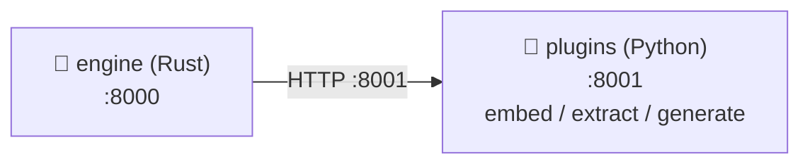
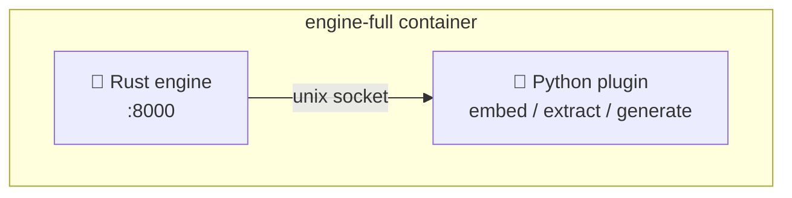

# Deployment Guide — AI Graph Engine

## System Requirements

### Minimum (development)

| Component | Requirement |
|---|---|
| OS | Ubuntu 20.04+ / Debian 11+ / macOS 12+ |
| RAM | 4 GB |
| Disk | 10 GB |
| CPU | 2 cores |
| Docker | 24.0+ |
| Docker Compose | v2.0+ |

### Recommended (production, 100k nodes)

| Component | Requirement |
|---|---|
| RAM | 24 GB (HNSW ~1.5 GB + cache ~300 MB + OS overhead) |
| Disk | 50 GB SSD |
| CPU | 8 cores |
| Network | 1 Gbps internal (if engine and plugin run on separate machines) |

---

## Two Build Variants

The engine ships as two Docker images. Choose the one that fits your deployment:

| Image | Description | Size |
|---|---|---|
| `LinkingMem:engine` | Rust engine only. Bring your own plugin. | ~50 MB |
| `LinkingMem:full` | Rust engine + Python text plugin in one container. | ~2–3 GB |

### engine — bring your own plugin

The engine does not bundle a plugin. You point it at any HTTP server (or unix socket)
that implements the [Plugin Interface](PLUGIN_INTERFACE.md).

Use this when:
- You want to run the plugin on a separate machine or container
- You have a custom plugin written in any language
- You want a minimal image with no Python/ML dependencies

### full — batteries included

Bundles the reference Python text plugin. The engine and plugin communicate over
a unix socket inside the container — no TCP overhead, no external dependency.

Use this when:
- You want a single container with no external services
- You are running on a single host
- You want the simplest possible setup

---

## Quick Start

### 1. Prepare environment

```bash
git clone <repo>
cd LinkingMem
cp .env.example .env
# Edit .env — set at minimum your LLM API key:
#   GEMINI_API_KEY=your-key   (or OPENAI_API_KEY / ANTHROPIC_API_KEY)
```

### 2. Seed initial data

The engine needs `data/` to exist before it starts.

```bash
# Option A — import a JSON file via the ingest binary
cargo build --manifest-path core/Cargo.toml --release --bin ingest
./core/target/release/ingest --input data/input.json --data-dir data

# Option B — start the stack first, then POST to /ingest/json
# (see API Reference for the ingest endpoint)
```

### 3. Start

```bash
# Two-container HTTP mode (default)
docker compose up --build

# Single-container unix-socket mode
docker compose --profile full up --build
```

First build takes 5–15 minutes (Rust compile + model download). Subsequent builds use
the layer cache and take ~30 seconds.

Engine is ready when you see:
```
engine  | INFO engine listening on 0.0.0.0:8000
```

### 4. Verify

```bash
curl http://localhost:8000/health | python3 -m json.tool
```

---

## Docker Compose Modes

### Default — two containers, HTTP

```bash
docker compose up
```



### Full — single container, unix socket

```bash
docker compose --profile full up
```



---

## Building Images Manually

```bash
# Engine only
docker build --target engine -t LinkingMem:engine .

# Full (default embedding model: all-MiniLM-L6-v2)
docker build --target full -t LinkingMem:full .

# Full with a different embedding model baked in
docker build --target full \
  --build-arg EMBED_MODEL=BAAI/bge-m3 \
  -t LinkingMem:full-bge .
```

---

## Running with a Custom Plugin

The `engine` image supports three ways to connect your own plugin.

### Option A — PLUGIN_URL environment variable (simplest)

All three endpoints (embed / extract / generate) are routed to the same URL.

```bash
docker run -p 8000:8000 \
  -v ./data:/data \
  -e PLUGIN_URL=http://my-plugin-server:8001 \
  LinkingMem:engine
```

Or put it in `.env` and use `--env-file`:

```env
# .env
PLUGIN_URL=http://my-plugin-server:8001
LLM_PROVIDER=openai
OPENAI_API_KEY=sk-...
```

```bash
docker run -p 8000:8000 -v ./data:/data --env-file .env LinkingMem:engine
```

### Option B — Custom plugins.toml (per-endpoint config)

Use this when embed / extract / generate run on different servers, or when you
need unix socket transport, auth tokens, or per-endpoint timeouts.

```toml
# my-plugins.toml

[plugins.embed]
transport  = "http"
url        = "http://embed-server:9000"

[plugins.extract]
transport  = "http"
url        = "http://llm-server:9001"
auth_token = "secret-token"

[plugins.generate]
transport  = "http"
url        = "http://llm-server:9001"
auth_token = "secret-token"
```

Mount at runtime:

```bash
docker run -p 8000:8000 \
  -v ./data:/data \
  -v ./my-plugins.toml:/app/plugins.toml:ro \
  LinkingMem:engine
```

Or tell the engine where the file is via env:

```env
# .env
PLUGIN_CONFIG_FILE=/config/plugins.toml
```

```bash
docker run -p 8000:8000 \
  -v ./data:/data \
  -v ./my-plugins.toml:/config/plugins.toml:ro \
  --env-file .env \
  LinkingMem:engine
```

### Option C — Extend the engine image

Bundle your plugin into a single image derived from `engine`:

```dockerfile
FROM LinkingMem:engine

# Add your plugin binary (any language)
COPY my-plugin /usr/local/bin/my-plugin

# Point the engine at it
COPY my-plugins.toml /app/plugins.toml

# Start both in an entrypoint script
COPY entrypoint.sh /entrypoint.sh
RUN chmod +x /entrypoint.sh
ENTRYPOINT ["/entrypoint.sh"]
```

```bash
# entrypoint.sh
#!/bin/sh
/usr/local/bin/my-plugin &
exec /usr/local/bin/server
```

---

## Environment Variables

All variables are read at startup. Pass via `--env-file .env` or individual `-e` flags.
See `.env.example` for the full list with descriptions.

### Core

| Variable | Default | Description |
|---|---|---|
| `BIND_ADDR` | `0.0.0.0:8000` | Engine listen address |
| `DATA_DIR` | `./data` | Directory for graph.bin, vectors.bin, delta.wal |
| `RUST_LOG` | `info` | Log level: `trace` `debug` `info` `warn` `error` |

### Plugin connection

| Variable | Default | Description |
|---|---|---|
| `PLUGIN_URL` | `http://localhost:8001` | Fallback URL for all plugin endpoints |
| `PLUGIN_CONFIG_FILE` | `./plugins.toml` | Path to plugins.toml (overrides PLUGIN_URL) |

### LLM / models (plugin side)

| Variable | Default | Description |
|---|---|---|
| `LLM_PROVIDER` | `gemini` | `gemini` \| `openai` \| `anthropic` |
| `EMBED_MODEL` | `all-MiniLM-L6-v2` | SentenceTransformers model name |
| `EXTRACT_MODEL` | `gemini-2.5-flash-lite` | Model for entity extraction |
| `GENERATE_MODEL` | `gemini-2.5-flash-lite` | Model for answer generation |
| `GEMINI_API_KEY` | — | Required when `LLM_PROVIDER=gemini` |
| `OPENAI_API_KEY` | — | Required when `LLM_PROVIDER=openai` |
| `ANTHROPIC_API_KEY` | — | Required when `LLM_PROVIDER=anthropic` |

### Auth & rate limiting

| Variable | Default | Description |
|---|---|---|
| `API_KEYS` | _(empty)_ | Comma-separated valid API keys. Empty = auth disabled |
| `RATE_LIMIT_PER_MINUTE` | `60` | Requests per minute per key |
| `RATE_LIMIT_BURST` | `20` | Burst capacity (token bucket) |

### Query tuning

| Variable | Default | Description |
|---|---|---|
| `HNSW_K` | `20` | Seed nodes from vector search |
| `BFS_DEPTH` | `2` | BFS expansion depth |
| `BFS_MAX_NODES` | `500` | Max nodes collected during BFS |
| `CONTEXT_TOP_N` | `50` | Top-N nodes sent to LLM |
| `CONTEXT_MIN_SCORE` | `0.3` | Minimum score to include a node |
| `EMBED_CACHE_SIZE` | `50000` | Max cached embedding vectors |
| `QUERY_CACHE_SIZE` | `10000` | Max cached query results |
| `QUERY_CACHE_TTL_SECS` | `300` | Query cache TTL in seconds |

### Delta store

| Variable | Default | Description |
|---|---|---|
| `DELTA_MERGE_THRESHOLD` | `500` | Auto-merge after this many buffered entries |
| `INSTANCE_ID` | `0` | Node ID partition (0–255) for distributed ingest |

---

## Embedding Models

| Model | Dim | Speed | Quality | RAM |
|---|---|---|---|---|
| `all-MiniLM-L6-v2` | 384 | Fast | Good | ~90 MB |
| `BAAI/bge-small-en-v1.5` | 384 | Fast | Better (EN) | ~120 MB |
| `all-mpnet-base-v2` | 768 | Medium | Better | ~420 MB |
| `BAAI/bge-m3` | 1024 | Slow | Best multilingual | ~2.2 GB |

For non-English data, `BAAI/bge-m3` is recommended.

> **Important**: Changing the embedding model requires re-ingesting all data.
> Old vectors are incompatible with a new model.

---

## Export and Import

The engine provides endpoints to export the full graph and re-import it.

### Export

```bash
# Download full graph as JSON
curl http://localhost:8000/export/graph \
  -H "Authorization: Bearer $API_KEY" \
  -o graph_export.json

# Stream as NDJSON (one JSON object per line)
curl "http://localhost:8000/export/graph?format=ndjson" \
  -H "Authorization: Bearer $API_KEY"

# POST variant (format in body)
curl -X POST http://localhost:8000/export/graph \
  -H "Authorization: Bearer $API_KEY" \
  -H "Content-Type: application/json" \
  -d '{"format":"ndjson"}'
```

### Import

```bash
# From JSON body
curl -X POST http://localhost:8000/import/graph \
  -H "Authorization: Bearer $API_KEY" \
  -H "Content-Type: application/json" \
  -d @graph_export.json

# From file upload (JSON or NDJSON, auto-detected)
curl -X POST http://localhost:8000/import/graph/upload \
  -H "Authorization: Bearer $API_KEY" \
  -F "file=@graph_export.json"
```

Response:
```json
{
  "nodes_added": 18,
  "edges_added": 31,
  "skipped_edges": 0,
  "delta_size": 49
}
```

Imported nodes/edges land in the delta buffer. Call `POST /delta/merge` to flush
them into the main graph immediately, or wait for the auto-merge threshold.

---

## Production Checklist

- [ ] Set `API_KEYS` — do not leave auth disabled in production
- [ ] Set LLM API key (`GEMINI_API_KEY` / `OPENAI_API_KEY` / `ANTHROPIC_API_KEY`)
- [ ] Mount a persistent volume at `/data`
- [ ] Take an initial backup of `data/` after ingest
- [ ] Verify `GET /health` returns `status: ok`
- [ ] Verify `GET /metrics` returns Prometheus metrics
- [ ] Tune `RATE_LIMIT_PER_MINUTE` for expected load
- [ ] Set `DELTA_MERGE_THRESHOLD` appropriate to your ingest rate
- [ ] Put a reverse proxy (nginx / Caddy) in front for TLS termination

---

## Nginx Reverse Proxy

```nginx
upstream engine {
    server localhost:8000;
}

server {
    listen 443 ssl;
    server_name your-domain.com;

    ssl_certificate     /etc/letsencrypt/live/your-domain.com/fullchain.pem;
    ssl_certificate_key /etc/letsencrypt/live/your-domain.com/privkey.pem;

    location / {
        proxy_pass         http://engine;
        proxy_set_header   Host $host;
        proxy_set_header   X-Real-IP $remote_addr;
        proxy_read_timeout 120s;   # LLM calls can be slow
        proxy_send_timeout 120s;
    }
}
```

---

## Backup and Recovery

```bash
# Backup
tar -czf backup-$(date +%Y%m%d-%H%M%S).tar.gz data/

# Daily cron
echo "0 2 * * * cd /opt/LinkingMem && tar -czf /backups/data-\$(date +\%Y\%m\%d).tar.gz data/" | crontab -

# Restore
docker compose down
tar -xzf backup-20260101-020000.tar.gz
docker compose up -d
```

If the engine crashes during a delta merge, the main graph remains intact.
Re-ingest any data that was in the delta buffer (not yet merged).
Call `POST /delta/merge` after each large ingest batch to minimise exposure.

---

## Troubleshooting

### Engine fails to start

```bash
docker compose logs engine

# Common errors:
# "data/nodes.json not found"      → data/ not initialised, run ingest first
# "plugin server not reachable"    → plugin container not healthy yet, wait or check plugin logs
# "vectors.bin size mismatch"      → re-ingest data
```

### Plugin container crashes

```bash
docker compose logs plugins

# Common errors:
# "GEMINI_API_KEY not set"               → check .env
# "No module named sentence_transformers" → rebuild image
# OOM when loading model                  → increase container memory limit or use smaller model
```

### Slow queries

Check the `stats` field in the query response:

```bash
curl -s -X POST http://localhost:8000/query \
  -H "Authorization: Bearer $API_KEY" \
  -H "Content-Type: application/json" \
  -d '{"query":"test"}' | python3 -m json.tool | grep -A8 '"stats"'
```

| High latency field | Cause | Fix |
|---|---|---|
| embed time | Plugin overloaded | Increase uvicorn workers |
| LLM time | LLM API slow | Use a faster model |
| BFS time | Graph too large | Reduce `BFS_DEPTH` or `BFS_MAX_NODES` |

### Port already in use

```bash
sudo lsof -i :8000
sudo kill -9 <PID>
docker compose up
```
