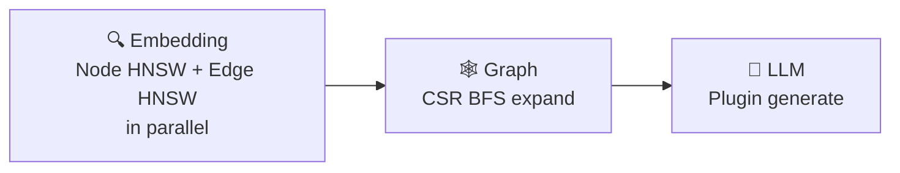
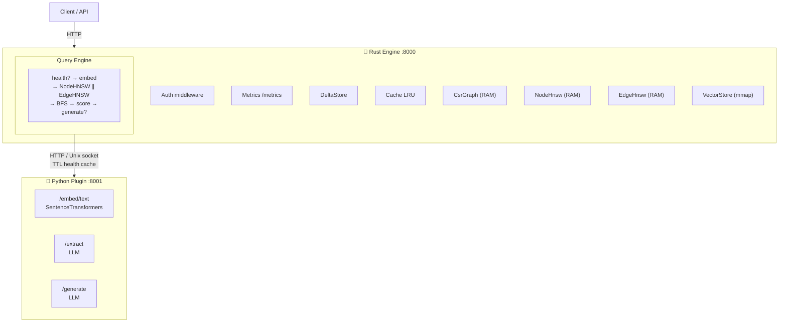
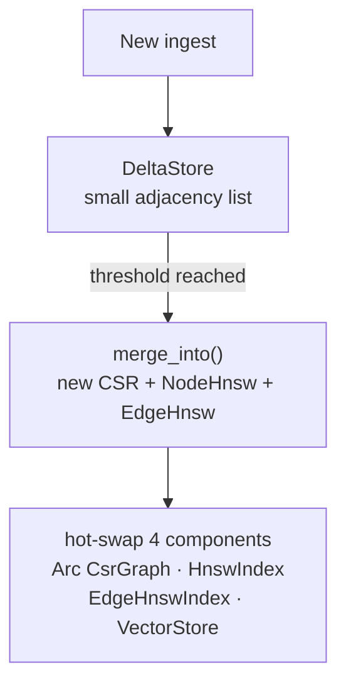
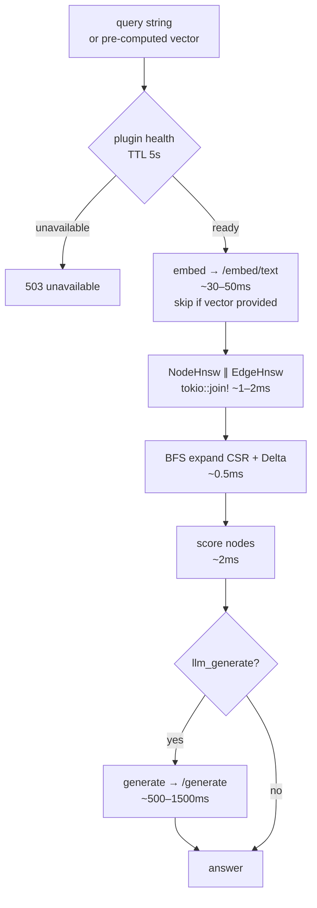

# System Design — LinkingMem

## 1. Overview

### Goals

Build an AI-integrated knowledge graph query engine that replaces a separate Neo4j + Qdrant architecture with a unified system optimized for RAG (Retrieval-Augmented Generation) workloads.

### Problems Being Solved

| Old architecture | Problem |
|---|---|
| Separate Neo4j + Qdrant | 2 network round-trips per query |
| Neo4j stores graph on disk | Slow traversal on large graphs |
| Qdrant manages vectors independently | No graph-aware scoring |
| Edges store only a type string | Relationship semantics lost; cannot search via embedding |
| No native LLM integration | Complex pipeline, hard to maintain |

### Solution



These three steps run in the same process, on the same machine, with no network hops between compute steps.

---

## 2. Overall Architecture



### Separation of Concerns

**Rust** handles all pure compute:
- Graph topology (CSR)
- Vector index (Node HNSW + Edge HNSW)
- BFS traversal
- Scoring
- HTTP server
- Auth, metrics, cache

**Python** handles all AI:
- Text embedding (SentenceTransformers)
- Entity extraction (LLM) — returns `full_context` for each entity and relation
- Answer generation (LLM)

Reason: Rust lacks a mature AI ecosystem. Python lacks the performance required for graph/vector compute. Each side focuses on its strengths.

---

## 3. Data Model

### Node

```json
{
  "id": 42,
  "name": "Alice Johnson",
  "node_type": "Person",
  "weight": 0.87,
  "props": { "role": "CEO", "company": "Acme Corp" },
  "full_context":  "Alice Johnson is the CEO of Acme Corp since 2018. She leads strategy and product development, directly managing 3 departments...",
  "embed_context": "Alice Johnson, CEO at Acme Corp, leads strategy"
}
```

- `id`: u32, numeric index into the CSR array
- `weight`: normalised degree (0.0–1.0), used in scoring
- `props`: arbitrary JSON metadata
- `full_context`: verbose description — passed to the **LLM** when generating an answer. May be long.
- `embed_context`: short dense description — used to **embed into NodeHnswIndex**. Optional; falls back to `full_context`, then `name` if absent.

### Edge

```json
{
  "from": 42,
  "to": 17,
  "edge_type": "works_at",
  "weight": 1.0,
  "full_context":  "Alice Johnson works at Acme Corp as CEO since 2018, responsible for all executive operations...",
  "embed_context": "Alice Johnson is CEO at Acme Corp since 2018"
}
```

- `full_context`: verbose description of the relationship — passed to the LLM
- `embed_context`: short dense description — used to **embed into EdgeHnswIndex**. Optional; falls back to `full_context`, then `edge_type` if absent.

### Unified Ingest Payload

```json
{
  "entities": [ ...NodeInfo ],
  "relations": [ ...EdgeInfo ]
}
```

String `id` values in the payload are mapped to numeric `u32` when building the CSR.

---

## 4. Core Components

### 4.1 CsrGraph (Compressed Sparse Row)

Stores the entire graph topology in 2 contiguous arrays:

```
offsets: [0, 2, 5, 6, 8]     ← node i starts at offsets[i]
edges:   [1, 3, 0, 2, 4, 1, 0, 4]  ← all neighbors packed contiguously
```

`neighbors(node i)` = `edges[offsets[i]..offsets[i+1]]`

No pointers, no allocation — a slice that references RAM directly.

### 4.2 HnswIndex (Node HNSW)

Hierarchical Navigable Small World graph for node embeddings.

- Upper layers: few nodes, long-range connections → coarse navigation
- Layer 0: all nodes, short-range connections → fine search

Search: entry from the top → greedy descent → top-k results at Layer 0.

Complexity: O(log n) instead of O(n) for brute-force.

### 4.3 EdgeHnswIndex (Edge HNSW)

A dedicated HNSW index for **edge embeddings** (`full_context` of each edge).

Why it is needed: `edge_type: "works_at"` is too coarse. `full_context: "Alice is CEO at Acme Corp"` carries enough semantics to search by vector. Embedding only into node `full_context` would lose graph value (no distinction between node vs. relationship).

At query time: EdgeHnswIndex returns `(from_id, to_id, distance)` → endpoint nodes of matching edges → added to the BFS seed set.

At build time: runs in parallel with NodeHnswIndex during merge.

### 4.4 VectorStore (mmap)

Binary files `vectors.bin` and `edge_vectors.bin`:
```
[header: dim(u32) + num_vecs(u32)] + [vec_0: f32×dim] + [vec_1: f32×dim] + ...
```

Mapped into virtual memory. The OS decides which pages reside in RAM. Read = pointer arithmetic, no syscall.

### 4.5 EmbedCache (LRU)

Keeps embeddings of hot nodes in RAM. Avoids re-reading from mmap on every scoring pass.

- Capacity: 50,000 entries (~300 MB with dim=384)
- Thread-safe: `Mutex<LruCache<u32, Vec<f32>>>`

### 4.6 DeltaStore

Buffers new nodes/edges without requiring a full CSR rebuild:



Pattern mirrors LSM-tree: fast writes into a mutable buffer, compacted periodically.

WAL records both `node_vec` and `edge_vec` to guarantee complete crash recovery.

### 4.7 QueryEngine

Full pipeline:



### 4.8 Auth Middleware

Token bucket rate limiting per API key:
- Capacity: N burst requests
- Refill: M tokens/second
- Constant-time key comparison (timing-safe)

### 4.9 Metrics

Prometheus-compatible counters + histograms, purely atomic — no locks:
- `queries_total`, `queries_failed_total`
- `query_latency_ms` histogram (p50/p95/p99)
- `cache_hits_total`, `cache_misses_total`
- `delta_size`, `graph_nodes`, `graph_edges`

---

## 5. API Endpoints

| Method | Path | Auth | Description |
|---|---|---|---|
| GET | `/health` | Public | Status + metrics summary |
| GET | `/metrics` | Public | Prometheus text format |
| POST | `/query` | Required | Query the knowledge graph |
| POST | `/ingest/text` | Required | Ingest raw text |
| POST | `/ingest/json` | Required | Ingest structured payload |
| POST | `/delta/merge` | Required | Force-merge the delta buffer |

### Query Request

```json
{
  "query": "Who works at Company ABC?",
  "pipeline": { "llm_generate": true },
  "mode": "relationship",
  "options": {
    "hnsw_k": 20,
    "bfs_depth": 2,
    "bfs_max_nodes": 500,
    "context_top_n": 50,
    "weights": { "alpha": 0.3, "beta": 0.6, "gamma": 0.1 }
  }
}
```

Or with a pre-computed vector (skips the embed step):

```json
{
  "vector": [0.021, -0.143, 0.887, "..."],
  "pipeline": { "llm_generate": false }
}
```

### Query Response

```json
{
  "answer": "Alice Johnson (CEO) and Bob Smith (CTO) work at...",
  "subgraph": {
    "nodes": [
      {
        "id": 0,
        "name": "Alice Johnson",
        "type": "Person",
        "props": { "role": "CEO" },
        "score": 0.847,
        "vector_sim": 0.91,
        "hop": 0,
        "is_seed": true
      }
    ]
  },
  "stats": {
    "total_ms": 821,
    "cache_hit": false,
    "seed_nodes": 5,
    "subgraph_nodes": 47,
    "context_nodes": 20,
    "embed_ms": 38,
    "llm_ms": 743
  }
}
```

---

## 6. Design Decisions and Trade-offs

### CSR instead of adjacency list

| | CSR | Adjacency list |
|---|---|---|
| `neighbors()` | O(1) slice, cache-friendly | O(1) pointer deref, cache miss |
| BFS 100k nodes | ~1.2ms | ~8ms |
| Add edge | O(n) rebuild | O(1) |
| Memory | 2× u32 per edge | 24+ bytes per edge |

**Decision**: CSR for the read path. DeltaStore (adjacency list) for the write path. Periodic merge.

### HNSW instead of brute-force

| | HNSW | Brute-force |
|---|---|---|
| Search 10k vecs | ~120μs | ~2.5ms |
| Search 100k vecs | ~200μs | ~25ms+ |
| Build time | ~1.5s/10k | 0 |
| Recall | ~95% | 100% |
| Memory | O(n×M) | O(1) |

**Decision**: HNSW for production. Used for both node and edge indexes.

### Dual HNSW (node + edge) instead of node HNSW only

If only `full_context` is embedded into nodes, a query will find directly relevant nodes but lose relationship semantics. For example, "Alice collaborates with Bob on project X" lives in an edge, not in a node. Edge HNSW resolves this without sacrificing graph structure.

### embed_context separate from full_context

`full_context` serves two conflicting purposes: (1) providing rich context for the LLM, and (2) serving as text to embed into HNSW. The LLM needs verbose text; HNSW needs short dense text.

`embed_context` resolves this conflict: it holds 1–2 short sentences capturing the identity and role of the entity/relation, optimized for cosine similarity. `full_context` retains its LLM context role and may be arbitrarily long.

Embedding priority: `embed_context` (if present) → `full_context` (if short) → `name`/`edge_type`.

### HTTP instead of gRPC for Rust↔Python

HTTP is simpler, easier to debug, and requires no proto files. The latency overhead (~1ms) is negligible compared to LLM calls (~500ms+). Can be migrated to gRPC later if needed.

### mmap instead of loading everything into RAM

100k vectors × 384 dim × 4 bytes = ~150MB. With mmap, the OS keeps hot pages in RAM and cold pages on disk. No need to load everything at startup. Trade-off: the first page fault is slower.

### TTL-cached plugin health check

Call `/health` only when the pipeline will actually invoke the plugin. TTL of 5s avoids per-request overhead.

- `/query`: checks only when `needs_embed` (no `vector` provided) **or** `needs_generate` (`llm_generate=true`). A pure graph request (`vector` + `llm_generate=false`) is bypassed entirely — it never causes an unnecessary 503.
- `/ingest/text`, `/ingest/json`: always checks because embed is always called.

If the plugin is down: return 503 immediately instead of waiting for the full request timeout (60s default). Clearly distinguishes `503 plugin_unavailable` from `502 bad_gateway` (call succeeded but returned a logic error).

---

## 7. Current Limitations

- **Rebuild HNSW on merge**: every delta merge requires rebuilding both node HNSW and edge HNSW (~several seconds with 100k nodes). HNSW builds are offloaded to the blocking thread pool via `spawn_blocking` to avoid blocking the async runtime. Can be optimized with incremental HNSW in a future phase.
- **WAL recovery**: the delta WAL guarantees crash recovery for written data. However, nodes in the middle of a merge when a crash occurs may need to be re-ingested.
- **LLM latency dominates**: p50 ~600ms is due to the LLM (~500–1500ms), not graph/vector compute (~3ms total). Reduce by using a smaller model or caching LLM responses.
