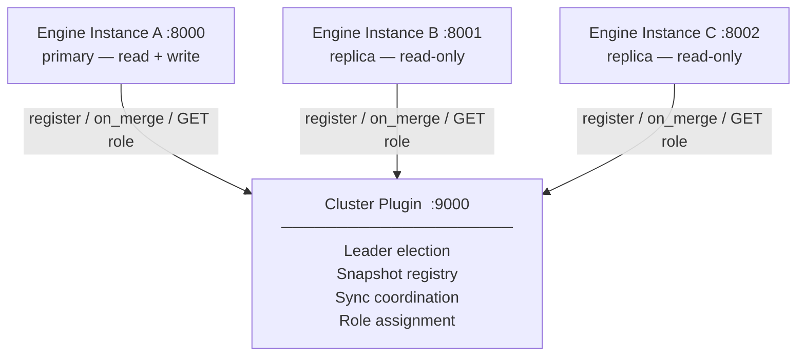

# Cluster Development Plan

## Overview

Goal: allow multiple engine instances to run in parallel, with clear separation
between a primary (read + write) and replicas (read-only), with automatic data
synchronisation coordinated by a dedicated **Cluster Plugin**.

The engine itself contains no cluster logic — it only asks the plugin "am I
allowed to write?" and notifies it "I just finished a merge". The plugin handles
the rest.

**Status**: Planned — see [roadmap.md](roadmap.md) Phase 16–17.

---

## Architecture



When `CLUSTER_PLUGIN_URL` is not set → engine runs in single-node mode,
no cluster calls are made.

---

## Phase 1 — Storage Abstraction ✅ (complete)

- `StorageBackend` trait abstracts all snapshot file I/O
- `LocalStorage` implementation wraps `std::fs`
- `builder::save/load`, HNSW save/load, `delta::merge_into` all go through `StorageBackend`
- `AppState` holds `Arc<dyn StorageBackend>` — ready to swap for S3 or other backends

No behavior change. Everything still reads/writes local files as before.

---

## Phase 2 — Data Hook Plugin (on_merge notification)

After each successful merge, the engine fires an optional `POST /on_merge` if
`DATA_PLUGIN_URL` is set. The plugin can do anything: push to S3, notify
replicas, record stats.

### Engine calls:

```http
POST {DATA_PLUGIN_URL}/on_merge
Content-Type: application/json

{
  "instance_id": "engine-a",
  "snapshot_path": "/data",
  "stats": {
    "nodes": 1240,
    "edges": 4832,
    "merged_at": "2026-04-06T10:00:00Z"
  }
}
```

### Plugin responds:

```json
{ "ok": true }
```

Engine does **not** block on the response — fire-and-forget via `tokio::spawn`.

### Config:

```env
DATA_PLUGIN_URL=http://localhost:9000   # unset = disabled
```

---

## Phase 3 — Cluster Plugin (multi-instance coordination)

### 3.1 Startup — register instance

On boot, the engine calls the cluster plugin to obtain its role:

```http
POST {CLUSTER_PLUGIN_URL}/register
Content-Type: application/json

{
  "instance_id": "engine-b",
  "addr": "http://engine-b:8000",
  "data_version": "abc123"
}
```

```json
{
  "role": "replica",
  "pull_from": "http://engine-a:8000/snapshot",
  "pull_required": true
}
```

If `pull_required: true` → engine downloads the snapshot from the primary,
loads it into memory, then begins serving requests.

### 3.2 Write gating — replicas reject writes

When a replica receives a write request (`/ingest/text`, `/ingest/json`,
`/delta/merge`):

```
• role == "replica"  →  409 Conflict
  { "error": "this instance is read-only", "primary": "http://engine-a:8000" }

• role == "primary"  →  process normally
```

Role is cached with a 30 s TTL. If the cluster plugin is unreachable:
- `CLUSTER_FAILOPEN=true`  → allow writes (default: fail-open for availability)
- `CLUSTER_FAILOPEN=false` → reject writes (strict consistency)

### 3.3 After merge — notify replicas

After a successful merge, the primary calls the cluster plugin:

```http
POST {CLUSTER_PLUGIN_URL}/on_merge
Content-Type: application/json

{
  "instance_id": "engine-a",
  "snapshot_available_at": "http://engine-a:8000/snapshot",
  "data_version": "def456",
  "stats": { "nodes": 1300, "edges": 5000 }
}
```

The cluster plugin decides: notify replicas immediately, schedule a pull,
or lazy-sync — engine does not care.

### 3.4 Replica sync — pull snapshot

The engine exposes an admin endpoint so the cluster plugin (or primary) can
trigger a snapshot pull:

```http
POST /admin/sync
Content-Type: application/json

{
  "pull_from": "http://engine-a:8000/snapshot",
  "data_version": "def456"
}
```

Engine downloads the snapshot → hot-swaps graph + HNSW + store atomically
(same mechanism as a local merge).

### 3.5 Snapshot endpoint (to be added)

```http
GET /snapshot
→  streams tar.gz of data/ (nodes.json, edges.bin, vectors.bin, ...)
```

Auth: master key or internal network only.

---

## Cluster Plugin Interface Summary

| Endpoint | Called when | Engine needs |
|---|---|---|
| `POST /register` | Startup | Role + pull instructions |
| `POST /on_merge` | After successful merge | Ack (fire-and-forget) |
| `GET /role` | Before write request (cached 30 s) | `"primary"` or `"replica"` |

The engine implements none of the cluster logic. The cluster plugin can use
etcd, Consul, Redis, or any coordination backend.

---

## Config (Phase 3)

```env
CLUSTER_PLUGIN_URL=http://cluster:9000    # unset = single-node mode
CLUSTER_INSTANCE_ID=engine-a             # default: hostname
CLUSTER_FAILOPEN=true                    # allow writes when cluster plugin is down
```

---

## Design Constraints

- **No distributed transactions**: primary writes then notifies — replicas may
  briefly serve stale reads. Acceptable for RAG workloads (eventual consistency).

- **Snapshot granularity = merge**: sync happens per merge, not per ingest.
  Delta entries between two merges live only in the primary's WAL.
  For near-real-time replicas, WAL streaming is needed (Phase 18 in roadmap).

- **Single primary**: no multi-primary. Write scaling requires sharding
  (Phase 19 in roadmap).

- **Cluster plugin is a SPOF**: if it goes down and `CLUSTER_FAILOPEN=false`,
  the engine rejects writes. Deploy the cluster plugin with HA
  (e.g. 3-node etcd or Consul cluster).
